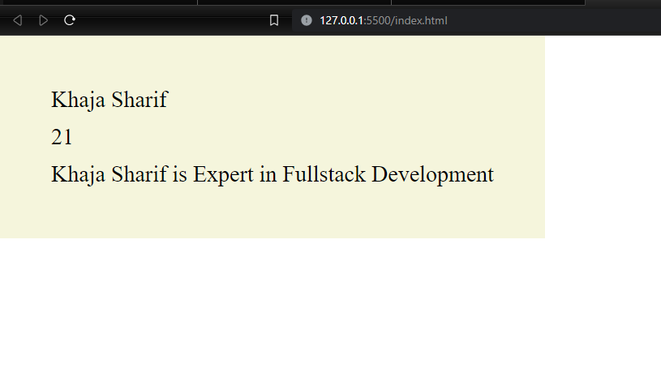

# Objects

## Table of Contents

- [Project Title](#project-title)
- [Description](#description)
- [Demo](#demo)
- [Technologies Used](#technologies-used)
- [Features](#features)
- [License](#license)
- [Reference videos](#reference-videos)

## Description

this folder contain in-depth knowledge about object

click [javascript](./javascripts/) folder to learn about object in js

[profile](./javascripts/profile.js) file contain the original object (intial stage of object )

later i added some property and methods to the intial object

those changes are added in [clone.js](./javascripts/clone.js) and [methodMergeing.js](./javascripts/methodMergeing.js) files

## Demo

## Technologies Used

Javascript

## Features

ES6 - modules (export and import ) used for code maintainablity

## License

MIT

## Reference videos

[ java script ES6+ objects property and methods - cyberdude networks | Modern JS playlist](https://youtu.be/-IWA5e9CNis?si=0I5Awep_B8HA3WuS)

## concepts to cover

- [ ] CRUD
- [x] Clone
- [x] Mergeing {}, [] , ""
